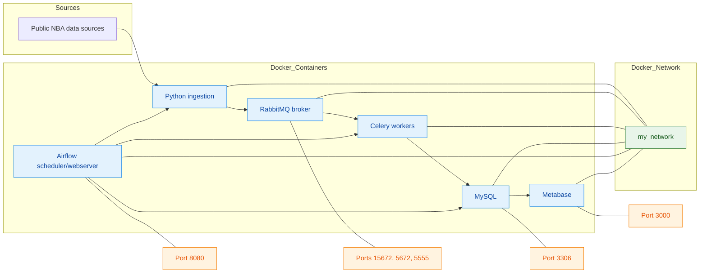

# NBAcharts 🏀📊🐳

用 Python 打造的 NBA 數據工程專案：從公開資料來源擷取 → 任務編排/排程 → 非同步處理 → 資料庫 → 儀表板，一條龍搞定！預設所有服務與流程都在 Docker 容器中運行，使用 Docker Compose 一鍵管理。

快速特性 ✨
- 🏀 NBA 主題：球隊/球員狀態、進階數據、薪資、新聞等
- 📨 任務佇列：RabbitMQ + Celery Workers
- 🗓️ 工作流：Airflow DAGs 定時與可觀測
- 🗄️ 儲存：MySQL
- 📊 視覺化：Metabase 儀表板
- 🐳 容器化：各角色各一容器，透過同一個 docker network 互聯

架構圖（全容器化 + Network + 常用埠號）🧩


資料來源聲明 🔓
- 僅使用公開可取得的 NBA 相關資料來源
- 不依賴私有或付費封閉資料源

目錄導覽 🗺️
- [data_ingestion/](data_ingestion/)：NBA 擷取與處理腳本、任務與共用工具
  - 例： [nba_teams_advance.py](data_ingestion/nba_teams_advance.py)、[nba_teams_state.py](data_ingestion/nba_teams_state.py)、[nba_players_state.py](data_ingestion/nba_players_state.py)、[nba_players_salary.py](data_ingestion/nba_players_salary.py)、[nba_news_udn.py](data_ingestion/nba_news_udn.py)、[nba_news_headline.py](data_ingestion/nba_news_headline.py)
  - 任務/Worker： [worker.py](data_ingestion/worker.py)、[tasks_crawler_player_salary.py](data_ingestion/tasks_crawler_player_salary.py)
  - 設定與連線： [config.py](data_ingestion/config.py)、[mysql.py](data_ingestion/mysql.py)、[nba_common.py](data_ingestion/nba_common.py)
- [airflow/](airflow/)：Airflow 設定、DAG 與 Compose
  - DAG： [NBA_data_dag.py](airflow/dags/NBA_data_dag.py)、[NBA_news_dag.py](airflow/dags/NBA_news_dag.py)
  - Compose： [docker-compose-airflow.yml](airflow/docker-compose-airflow.yml)
- [metabase/](metabase/)：Metabase Compose 與設定
  - Compose： [docker-compose-metabase.yml](metabase/docker-compose-metabase.yml)
- 根目錄 Compose： [docker-compose-broker.yml](docker-compose-broker.yml)、[docker-compose-mysql.yml](docker-compose-mysql.yml)、[docker-compose-worker.yml](docker-compose-worker.yml)、[docker-compose-producer.yml](docker-compose-producer.yml)

預設運行模式（100% Docker）🐳
- 所有服務皆以容器形式運行，並加入同一個 network: my_network
- 建議先建立 network：
```bash
docker network create my_network
```

一鍵啟動整套服務 🚀
```bash
# 1) Broker 與監控（RabbitMQ/Flower）
docker compose -f docker-compose-broker.yml up -d

# 2) 資料庫（MySQL）
docker compose -f docker-compose-mysql.yml up -d

# 3) Airflow（Scheduler/Webserver）
docker compose -f airflow/docker-compose-airflow.yml up -d

# 4) Workers（Celery）
docker compose -f docker-compose-worker.yml up -d

# 5) Producers（資料擷取/派發）
docker compose -f docker-compose-producer.yml up -d

# 6) Metabase（儀表板）
docker compose -f metabase/docker-compose-metabase.yml up -d
```

服務入口與埠號 🌐
- RabbitMQ 管理介面：http://localhost:15672
- AMQP：amqp://localhost:5672
- Flower（如有啟用）：http://localhost:5555
- MySQL：localhost:3306
- Airflow：http://localhost:8080 （預設帳密 airflow/airflow）
- Metabase：http://localhost:3000

關閉全部服務 ⛔
```bash
docker compose -f docker-compose-producer.yml down
docker compose -f docker-compose-worker.yml down
docker compose -f docker-compose-broker.yml down
docker compose -f docker-compose-mysql.yml down
docker compose -f airflow/docker-compose-airflow.yml down
docker compose -f metabase/docker-compose-metabase.yml down
```

常見任務與流程（在 Docker 中）🏃‍♂️
- Celery Workers 參數示例（已容器化，需在 compose 內調整或以 override 檔設定）：
  - --concurrency N、-Q <queue1,queue2>
- Airflow 使用
  - 啟動後進入 Web UI 啟用所需 DAG
  - 觀察 Task Instance logs/重試狀態
- Producers
  - 預設由 docker-compose-producer.yml 啟動，負責派發 NBA 擷取任務

開發者角落（可選；非預設）👩‍💻
- 若需在本機嘗試單支腳本（不建議於正式流程），請先載入環境變數後執行，例如：
```bash
source .env
uv run data_ingestion/producer_crawler_player_salary.py
python data_ingestion/nba_news_udn.py
```

疑難排解 🧯
- 看不到任務在跑？檢查 RabbitMQ、Celery Workers 與 Airflow 排程是否啟用
- 資料未寫入 MySQL？檢查 [data_ingestion/mysql.py](data_ingestion/mysql.py) 的連線設定與資料表初始化
- Metabase 看不到資料？確認它能連線到 MySQL 容器（同一 network）
- 連線失敗？確認 .env 與各 compose 檔中的服務主機名稱、帳密、埠號一致

貢獻與授權 🤝
- 歡迎提交 PR/Issue；請簡述修改動機與測試步驟
- 建議新增 .env.example 與 Metabase dashboard 經匯出檔，提升新手上手速度
- 授權：請參考根目錄（若尚未建立，建議補上 LICENSE）