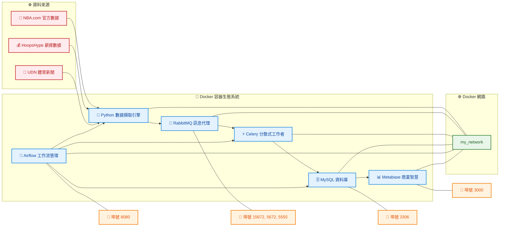

<div align="center">

# 🏀 NBAcharts
### *企業級NBA數據分析與視覺化平台*

[](https://python.org)
[](https://airflow.apache.org)
[](https://mysql.com)
[](https://docker.com)
[](https://docs.celeryproject.org)

*像Kobe一樣精準，如LeBron般全能的NBA數據分析系統* 🐍⚡

</div>

---

## 🏆 專案概述

> **"數據不會說謊，就像投籃命中率一樣真實"** - 這個平台讓你成為NBA數據分析的MVP！

這是一個基於 Python 的**企業級NBA數據工程解決方案**，實現從數據擷取到視覺化的完整流程。所有服務都在 Docker 容器中運行，透過 Docker Compose 實現一鍵部署與管理，就像完美的團隊配合一樣流暢！

### 🎯 核心特性

- **🏀 NBA全方位數據** - 涵蓋球隊與球員的狀態、進階統計、薪資分析與最新新聞
- **📨 分散式任務處理** - 使用 RabbitMQ 作為訊息代理，搭配 Celery Workers 實現高效能非同步處理
- **🗓️ 智慧工作流管理** - Airflow DAGs 實現數據擷取任務的自動排程與全面監控
- **🗄️ 企業級數據存儲** - 採用 MySQL 資料庫確保數據完整性與查詢效能
- **📊 商業智慧視覺化** - 透過 Metabase 建立專業級互動式儀表板
- **🐳 一鍵容器化部署** - 每個服務獨立容器化，透過共用網路實現完美互聯

---

## 🏗️ 系統架構

以下架構圖展示了各個容器如何協同工作，以及數據流動的完整路徑：



### 🎮 數據流程說明
1. **🏀 多源數據擷取** - Python爬蟲引擎同步擷取NBA官方、薪資、新聞等多元數據
2. **⚡ 智慧任務分發** - RabbitMQ高效分發任務到Celery分散式工作者
3. **🔄 自動化編排** - Airflow DAG智慧管理整個ETL流程
4. **💾 可靠數據存儲** - MySQL確保數據完整性與高效查詢
5. **📈 專業視覺化** - Metabase打造企業級分析儀表板

---

## 📁 專案結構

```
🏀 NBAcharts/
├── 📊 data_ingestion/              # 核心數據擷取引擎
│   ├── 🏀 nba_players_salary.py    # 球員薪資爬蟲 (HoopsHype)
│   ├── 📈 nba_players_state.py     # 球員表現統計
│   ├── 🏟️ nba_teams_salary.py      # 球隊薪資分析
│   ├── 📊 nba_teams_state.py       # 球隊基礎數據
│   ├── 🎯 nba_teams_advance.py     # 球隊進階統計
│   ├── 📰 nba_news_headline.py     # NBA官方新聞
│   ├── 📰 nba_news_udn.py          # UDN體育新聞
│   ├── 🔧 config.py                # 環境配置管理
│   ├── 🗄️ mysql.py                 # 資料庫連接與表結構
│   ├── ⚡ worker.py                # Celery工作者配置
│   └── 🔄 dataprocess.py           # 數據處理與合併
│
├── 🚀 airflow/                     # Apache Airflow 工作流
│   ├── 📋 dags/
│   │   ├── 🏀 NBA_data_dag.py      # NBA數據處理DAG
│   │   └── 📰 NBA_news_dag.py      # 新聞擷取DAG
│   ├── ⚙️ airflow.cfg              # Airflow配置
│   └── 🐳 docker-compose-airflow.yml
│
├── 📊 metabase/                    # 商業智慧視覺化
│   └── 🐳 docker-compose-metabase.yml
│
├── 🐳 Docker配置檔案
│   ├── docker-compose-broker.yml   # RabbitMQ訊息佇列
│   ├── docker-compose-mysql.yml    # MySQL資料庫
│   ├── docker-compose-producer.yml # 任務生產者
│   └── docker-compose-worker.yml   # Celery工作者
│
└── 📋 pyproject.toml               # Python專案配置
```

---

## 🚀 快速啟動指南

### 🏀 第一節：前置準備

```bash
# 🏆 確保已安裝 Docker 與 Docker Compose
docker --version
docker-compose --version

# 🌐 建立 Docker 網路（讓所有服務能夠完美配合）
docker network create my_network
```

### 🏀 第二節：一鍵啟動所有服務

像組建冠軍隊伍一樣，按順序啟動各個核心服務：

```bash
# 🐰 1. 啟動訊息代理 (RabbitMQ/Flower)
docker compose -f docker-compose-broker.yml up -d

# 🗄️ 2. 啟動資料庫 (MySQL)
docker compose -f docker-compose-mysql.yml up -d

# 🚀 3. 啟動 Airflow (Scheduler/Webserver)
docker compose -f airflow/docker-compose-airflow.yml up -d

# ⚡ 4. 啟動任務 Workers (Celery)
docker compose -f docker-compose-worker.yml up -d

# 🕷️ 5. 啟動數據擷取 Producers
docker compose -f docker-compose-producer.yml up -d

# 📊 6. 啟動儀表板 (Metabase)
docker compose -f metabase/docker-compose-metabase.yml up -d
```

### 🏀 第三節：服務入口與管理介面

| 🎯 服務 | 🌐 網址 | 👤 帳號密碼 | 📝 說明 |
|---------|---------|-------------|---------|
| **🚀 Airflow** | http://localhost:8080 | `airflow` / `airflow` | 工作流管理與監控中心 |
| **🐰 RabbitMQ** | http://localhost:15672 | `guest` / `guest` | 訊息佇列管理介面 |
| **🌸 Flower** | http://localhost:5555 | - | Celery任務監控儀表板 |
| **📊 Metabase** | http://localhost:3000 | 初次設定 | 商業智慧分析平台 |
| **🗄️ MySQL** | localhost:3306 | 配置檔設定 | 資料庫連接 |

---

## 🎯 核心功能特色

### 🏀 球員數據分析
- **💰 薪資追蹤** - 2014-2025年完整薪資數據，支援薪資趨勢分析
- **📊 表現統計** - 投籃命中率、籃板、助攻等30+項詳細數據
- **🎯 效率指標** - 真實命中率、有效投籃命中率等進階統計

### 🏟️ 球隊深度分析
- **💸 薪資結構** - 球隊總薪資與薪資分配分析
- **🏆 戰績統計** - 勝率、淨勝分、畢氏勝場數等
- **⚡ 進階指標** - 進攻/防守評分、節奏因子、賽程強度

### 📰 新聞情報整合
- **🏀 官方新聞** - NBA.com即時新聞頭條
- **📺 媒體報導** - UDN體育新聞整合
- **🔄 自動更新** - 每日定時擷取最新資訊

---

## ⚡ 進階操作

### 🔧 環境變數配置

建議建立 `.env` 檔案進行環境配置：

```bash
# MySQL 資料庫設定
MYSQL_HOST=mysql
MYSQL_PORT=3306
MYSQL_USERNAME=root
MYSQL_PASSWORD=your_secure_password
MYSQL_DATABASE=NBA

# RabbitMQ 設定
RABBITMQ_HOST=rabbitmq
RABBITMQ_PORT=5672
WORKER_USERNAME=worker
WORKER_PASSWORD=worker_password
```

### 🎮 自訂工作流程

```python
# 🏀 建立自訂DAG範例
from airflow import DAG
from data_ingestion.nba_players_salary import player_year_salary

def my_custom_nba_analysis():
    # 你的客製化分析邏輯
    player_year_salary(2024)
```

### 🛠️ 開發者模式

若需在本機進行開發測試（非正式流程）：

```bash
# 🔥 載入環境變數
source .env

# 🏀 執行單一爬蟲腳本
uv run data_ingestion/producer_crawler_player_salary.py
python data_ingestion/nba_news_udn.py

# ⚡ 啟動本機Celery工作者
uv run celery -A data_ingestion.worker worker --loglevel=info
```

---

## 🛑 關閉服務

若要停止並移除所有容器，請依相反順序執行：

```bash
docker compose -f metabase/docker-compose-metabase.yml down
docker compose -f docker-compose-producer.yml down
docker compose -f docker-compose-worker.yml down
docker compose -f airflow/docker-compose-airflow.yml down
docker compose -f docker-compose-mysql.yml down
docker compose -f docker-compose-broker.yml down
```

---

## 🔍 疑難排解

### 常見問題與解決方案

- **❓ 看不到任務在執行？**
  - 檢查 RabbitMQ、Celery Workers 與 Airflow 排程是否正常啟用
  - 確認 Airflow Web UI 中的 DAG 已啟用

- **❓ 資料未寫入 MySQL？**
  - 檢查 [`mysql.py`](data_ingestion/mysql.py) 的連線設定
  - 確認資料表是否正確初始化

- **❓ Metabase 看不到資料？**
  - 確認 Metabase 能連線到 MySQL 容器（同一 network）
  - 檢查資料庫連接設定

- **❓ 容器間連線失敗？**
  - 確認所有容器都加入了 `my_network`
  - 檢查 `.env` 與各 compose 檔中的服務主機名稱、帳密、埠號一致

---

## 📊 資料庫架構

### 🏀 核心資料表

| 📋 資料表 | 📝 說明 | 🔑 主鍵 | 📈 資料範圍 |
|-----------|---------|---------|-------------|
| `nba_player_salary` | 球員薪資數據 | year, player, team | 2014-2025 |
| `nba_player_state` | 球員表現統計 | year, player, team | 詳細比賽數據 |
| `nba_team_salary` | 球隊薪資總額 | year, team | 年度薪資統計 |
| `nba_team_state` | 球隊基礎數據 | year, team | 基礎比賽統計 |
| `nba_team_advance` | 球隊進階統計 | year, team | 進階分析指標 |
| `nba_news_headline` | NBA官方新聞 | news_at, title | 即時新聞頭條 |
| `nba_news_udn` | UDN體育新聞 | id | 中文體育新聞 |

---

## 🏆 技術棧

### 🔧 核心技術
- **🐍 Python 3.8+** - 核心開發語言
- **🕷️ BeautifulSoup4** - HTML解析與網頁爬蟲
- **📊 Pandas** - 資料處理與分析
- **🗄️ SQLAlchemy** - ORM與資料庫操作

### ⚡ 分散式系統
- **🐰 RabbitMQ** - 高效能訊息佇列
- **⚡ Celery** - 分散式任務處理
- **🚀 Apache Airflow** - 工作流程編排與調度

### 🗄️ 資料存儲與視覺化
- **🐬 MySQL** - 關聯式資料庫
- **📊 Metabase** - 商業智慧與視覺化

### 🐳 部署與維運
- **🐳 Docker** - 容器化部署
- **🔧 Docker Compose** - 多服務編排
- **🌸 Flower** - Celery任務監控

---

## 🤝 貢獻指南

歡迎所有NBA數據愛好者加入這個專案！🏀

### 🎯 如何貢獻
1. **Fork** 這個專案
2. 建立你的功能分支 (`git checkout -b feature/amazing-feature`)
3. 提交你的修改 (`git commit -m 'Add some amazing feature'`)
4. 推送到分支 (`git push origin feature/amazing-feature`)
5. 開啟一個 **Pull Request**

### 🏆 貢獻類型
- **🐛 Bug修復** - 幫助我們發現並修復問題
- **✨ 新功能** - 新增更多NBA資料源或分析功能
- **📚 文檔改善** - 完善使用說明或技術文檔
- **🎨 UI/UX優化** - 改善Metabase儀表板設計
- **⚡ 效能優化** - 提升系統處理效率

在提交 PR 前，請簡述您的修改動機與測試步驟。建議新增 `.env.example` 與 Metabase dashboard 匯出檔，提升新手上手速度。

---

## 📄 授權條款

本專案採用 MIT 授權條款 - 詳見 [LICENSE](LICENSE) 檔案

---

## 🙏 致謝

- **🏀 NBA.com** - 提供官方數據與新聞來源
- **💰 HoopsHype** - 球員薪資數據來源
- **📰 UDN體育** - 中文體育新聞整合
- **🐍 Python社群** - 優秀的開源工具與函式庫
- **🚀 Apache基金會** - Airflow工作流程管理工具

---

<div align="center">

### 🏆 讓數據說話，讓分析發光！

**如果這個專案對你有幫助，請給我們一個 ⭐ Star！**

*Built with ❤️ for NBA data enthusiasts*

</div>